# Corthreads 

Corthreads is a web application that serves as a solidarity platform connecting donors and recipients of biological products (blood and organs) in Algeria.

##  The Meaning Behind the Name

The name Corthreads is not a coincidence:

- **"cor"** comes from Latin and means heart
- **"threads"** comes from English and means strings/links

Together, they symbolize the invisible threads connecting the hearts of donors and recipients forever.

The dominant pink color is not just an aesthetic choice, but a softer representation of blood and also a tribute to Pink October.

##  Demo & Design

### Database Schema
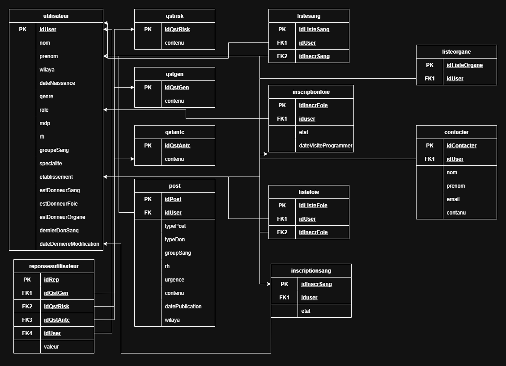

### UI/UX Design (Figma)
[**View Full Design on Figma**](https://www.figma.com/design/1QYrqQESOQ5DM5vpOmKLQx/corthreads-design?node-id=0-1&t=xvQv6qhzC4GLkE7j-1)

### Screenshots

| Homepage | Login | Donation Requests |
|----------|-------|-------------------|
| 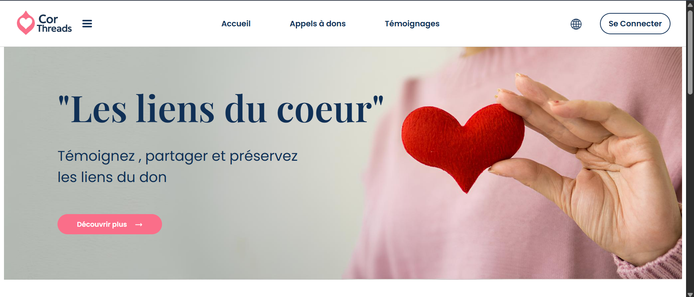 | 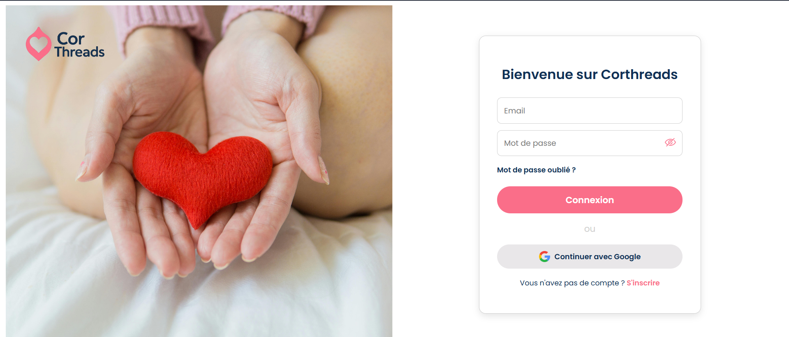 |  |

| Registration | Make a Donation | Testimonials |
|--------------|-----------------|--------------|
| 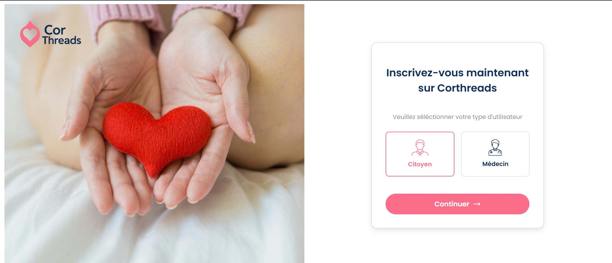 | 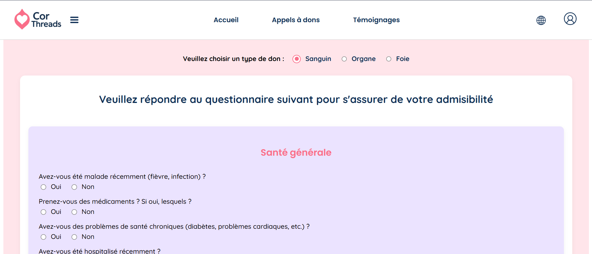 | 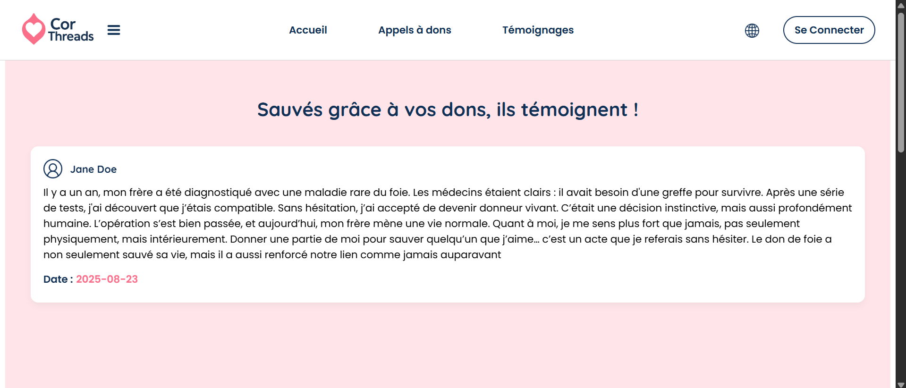 |

| Potential Donors List | Validated Donors List | Share a Donation Request |
|-----------------------|------------------------|--------------|
| 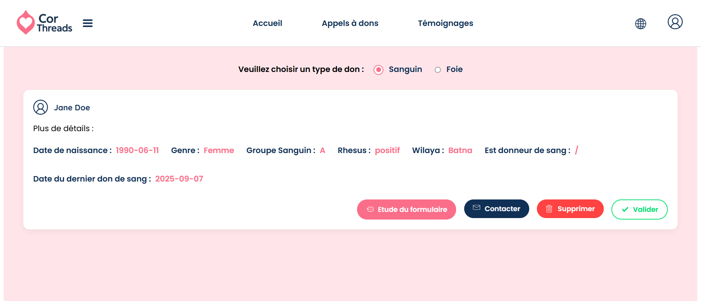 | 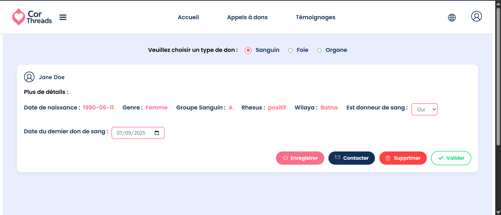 | 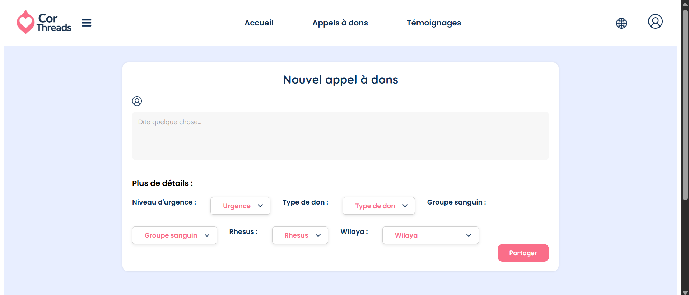 |

| Share a Testimony | Vertical Menu | Success Message |
|-------------------|---------------|-----------------|
| 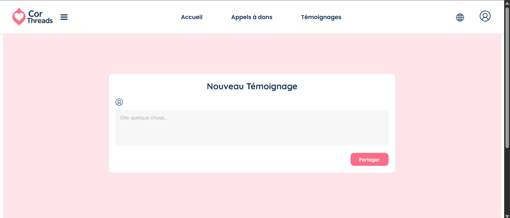 | 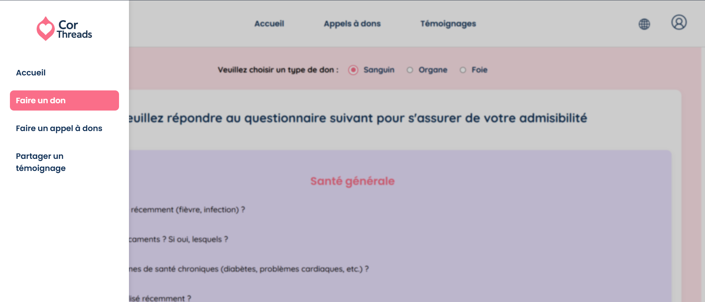 | 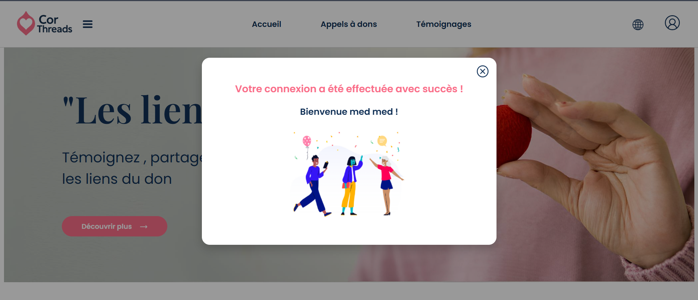 |


### Video Demo
 [Watch the demo video]()

##  Technical Stack

- **Design**: Figma
- **Backend**: Java with Spring Boot
- **Frontend**: Vue.js
- **API**: REST API provided by the backend
- **Responsive design**: Works on all screen sizes
- **Language**: French

##  Features & Functionality

###  For Anonymous Users
- Browse donation requests shared on the platform
- Filter requests by criteria:
  - Donation type: Blood – Liver – Organ
  - Wilaya (region) of the request
  - Urgency level
- Read testimonies about the positive impact of donations

###  User Registration
To become a donor, share a donation request, or post a testimony, users must sign up/log in.

**Authentication options:**
- Email & password
- Continue with Google

**Two types of users:**
- Citizen
- Doctor

###  As a Citizen
- Apply to donate by selecting a donation type
- Submit an application or answer a questionnaire
- Applications are reviewed by a Doctor
- If validated, the donor is added to the Validated Donors List and contacted by email when a matching recipient exists

**Citizens can also:**
- Post donation requests
- Share testimonies

###  As a Doctor
Doctors have extended rights:
- Review donor applications and questionnaires
- Validate or reject potential donors
- Contact donors by email for additional information or medical appointments
- Remove suspicious donors or donation requests

**Once a donor is validated:**
- Their information is added to the Validated Donors List
- Doctors connect validated donors with potential recipients by contacting them via email

###  Additional Features
- Contact form for questions or support
- Ability to update registration information (once every 30 days)
- Security:
  - Confidential handling of personal data
  - Passwords are encrypted

##  Project Structure

```
corthreads/
│── backend/       
│── frontend/       
│── design/        
│── screenshots/    
│── demo/          
│── README.md       
```

##  Notes

- All user data is strictly confidential
- Passwords are stored securely using encryption

##  License

This project is licensed under the MIT License.
You are free to use, modify, and distribute this project, but please give credit.
